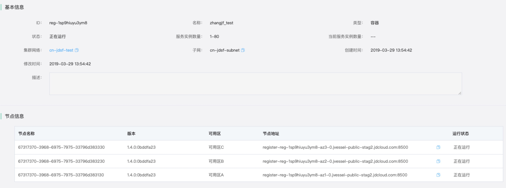
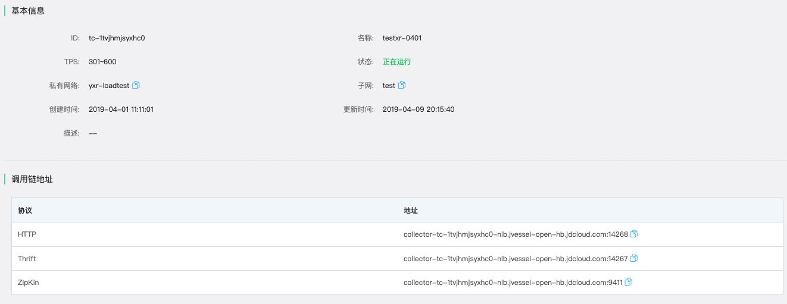

# JDSF DotNet Core Demo

## 项目说明

* 本项目为JDSF DotNet Core Demo 项目，主要介绍了用户通过使用京东云JDSF产品如何构建一个简单的分布式服务应用。

## 环境准备

* 项目使用 dotnet core 2.2 版本进行编写，在运行时需要安装 dotnet core 2.2 的SDK

* 如果需要修改代码，推荐安装Visual Studio 2017 ,Visual Studio 2019 或者 Visual Studio Code 等开发工具
  
## 项目结构

|- JDSF.Demo.Client  
|- JDSF.Common  
|- JDSF.Demo.Server  
|- JDSFDemo.sln  
|- image  
其中 JDSF.Demo.Server  是服务的生产者  
JDSF.Demo.Client   为服务的消费者  
JDSF.Common 为 asp dotnet Core 通用类库，主要实现了负载、调用链、和注册中心响应的功能  
JDSFDemo.sln 为项目的解决方案  
image 为说明文档的引用的图片

## 项目依赖类库说明

* consul ：注册中心使用类库

* OpenTracing.Contrib.NetCore ：基于OpenTracing 的NetCore 开源类库

* Jaeger : 链路跟踪的实现方案

* Refit.HttpClientFactory : Refit 实现的基于Rest接口的Api 调用，可以实现基于接口描述生成Http请求的类库[refit GitHub](https://github.com/reactiveui/refit)

## 配置及使用说明

* 项目在Programe 中使用了基于配置文件加载的启动 ip 和端口，如果不进行配置默认使用的地址为 http://0.0.0.0:5000 需要在 appsettings.Development.json 或者appsettings.json 配置 `App`->`AppPort` 属性，具体的配置如下：  

* 在代码中需要配置应用的名称以及调用链采集服务的地址和端口 等信息，具体代码需要在`appsettings.Development.json` 中,如果需要启动正式的环境发布，请将配置配置在`appsettings.json`，详细配置代码如下

  ```json
    "JDSFConfig": { //jdsf 配置
     "App":{
       "AppName":"dotnet-demo-client", //应用名称
       "AppPort":15000   //应用启动端口号
     },
     "Consul":{
        "Address":"10.12.209.43", //注册中心地址
        "Port":8500,              // 注册中心端口号
        "Config":{
          "Enable":false           // 是否启用配置中心功能（暂时 demo 没有支持此功能）
        },
        "Discover":{               // 服务发现配置
          "Enable":true,           // 是否启用服务发现
          "ServiceInstanceId":"dotnet-demo-client-1", // 服务实例 id
          "HealthCheckUrl":"/api/health/check",     // 健康检查地址
          "InstanceZone": "cn-north-1a",             // 当前服务所在的可用区
          "PreferIpAddress":true                     // 使用 ip 注册 如果为 false 使用域名注册
        }
     },
     "Trace":{                    // 链路追踪配置
        "Enable":true,
        "SimpleType":"CONST",     // 采集方法
        "TraceHttpAddress": "10.12.142.97",  //调用地址
        "TraceHttpPort": 14268         // 调用端口号
     }
  }
  ```

## 部分代码使用说明

* 关于使用 httpClient 进行负载和调用链跟踪，请看下面的代码：

```csharp
  services.AddHttpClient("LoadBalance").AddHttpMessageHandler<LoadBalanceHttpHandler>(); // 添加负载使用的HttpClientFactory LoadBalanceHttpHandler 默认已经注入对象，此Handler 实现了负载的自动判断逻辑

  services.AddHttpClient("db-service", (obj) =>
  {
    obj.BaseAddress = new Uri("http://db-service");
  }).AddTypedClient(c=> Refit.RestService.For<IDBService>(c))
  .AddHttpMessageHandler<LoadBalanceHttpHandler>(); //此配置为使用了Refit 创建的服务，可以直接注入相关的接口进行调用
```

## 代码运行及调试

### STEP1：在京东云上 [开通](https://www.jdcloud.com/cn/public/testApply/jdsf) 京东云分布式服务框架产品的使用权限

* 当前产品处于公测状态，免费使用。公测版本即是正式稳定的服务版本，用户不必担心稳定性与安全性问题，请放心试用。公测期结束后，产品将按实例的规格付费，并且用户不必重新开通新服务或切换服务

### STEP2：创建注册中心、创建调用链服务

* 创建流程参考 [京东云分布式服务框架产品文档](https://docs.jdcloud.com/cn/jd-distributed-service-framework/product-overview)

### STEP3：在配置文件配置注册中心地址

* 在创建注册中心列表页面点击集群信息，在`节点信息`部分获取注册中心节点地址，如下图所示: 

* 将获取的注册中心节点地址配置在 demo 的appsettings.Development.json文件中的  `Consul`->`Address` 配置项，JDSF.Demo.Client和 JDSF.Demo.Server 都需要配置

### STEP4：配置调用链的服务地址

* 在调用链分析服务列表页面中，点击创建的服务名称，进入详细信息页面，在`调用链地址`详情处获取Thrift协议地址，如下图所示：

* 需要在京东云的云主机上启动Jaeger Agent 然后配置上面获取到的Thrift协议请求地址

* Demo 使用的协议为 Http 传输 Thrift 序列化的数据，在`调用链地址`详情处获取Http协议地址和端口号 配置在appsettings.Development.json文件中的`Trace`->`TraceHttpAddress` 和`Trace`->`TraceHttpPort`配置项，JDSF.Demo.Client和 JDSF.Demo.Server 都需要配置

### STEP5：获取项目的相关依赖编译和运行源代码

* 如果在 windows 、linux 或者 mac 环境下 可以在安装dotnet core 2.2 版本的SDK后，在JDSF.Demo.Server 文件夹下开启命令行、 bash shell或者 powershell 执行

  ```powershell
    dotnet restore
    dotnet run
  ```

* 然后使用相同的命令在文件夹JDSF.Demo.Client 下启动消费者

### STEP6：验证部署结果

* 访问URL `http://<host>:<port>/api/refit/gameInfo?gameId=111`（gameId 的值可自定义），查看请求结果。在调用链分析服务页中的`依赖图谱` 中，您将可以看到响应的调用依赖信息，具体的操作请参考[京东云分布式服务框架产品文档](https://docs.jdcloud.com/cn/jd-distributed-service-framework/product-overview)
